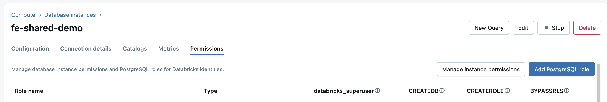
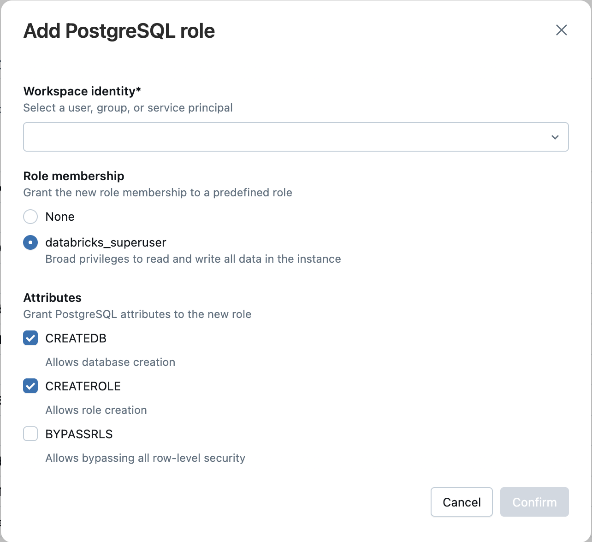

# FastPgCache 🐘⚡

A **fast Redis-like caching library** for PostgreSQL with high performance using UNLOGGED tables. Get Redis-style caching without the extra infrastructure!

## Why FastPgCache?

- **🚀 Fast** - Uses PostgreSQL UNLOGGED tables for Redis-like performance
- **⚡ CuckooFilter** - Lightning-fast negative lookups (10-1000x speedup for missing keys)
- **📦 Batch Operations** - `set_many()` for high-throughput bulk inserts
- **⏰ TTL Support** - Automatic expiry like Redis SET with EX
- **🔄 Redis-like API** - Familiar methods: `set()`, `get()`, `delete()`, `exists()`, `ttl()`
- **🎯 Simple** - One less service to manage
- **💪 ACID** - Get caching within PostgreSQL transactions
- **📦 JSON Support** - Automatic JSON serialization/deserialization
- **🔐 Databricks Integration** - Simplified API with automatic token rotation
- **🔒 User Isolation** - Automatic per-user cache isolation (no race conditions!)

## 🚀 Performance: UNLOGGED vs Regular Tables

FastPgCache uses PostgreSQL **UNLOGGED tables** for dramatically better performance. Here are real-world benchmarks from Databricks PostgreSQL:

### Load Test Results (10 threads, 100 ops each)

| Metric | UNLOGGED Table | Regular Table | Improvement |
|--------|----------------|---------------|-------------|
| **Throughput** | **553 ops/sec** | 496 ops/sec | **+11.5%** |
| **SET Mean** | **7.58 ms** | 12.17 ms | **37% faster** |
| **SET P95** | **10.71 ms** | 17.97 ms | **40% faster** |
| **SET P99** | **14.65 ms** | 21.67 ms | **32% faster** |
| **GET Mean** | **7.60 ms** | 8.04 ms | **5% faster** |
| **GET P95** | **10.74 ms** | 12.09 ms | **11% faster** |

**Key Takeaway:** UNLOGGED tables provide **37% faster writes** and **11.5% higher throughput**, making them ideal for caching workloads.

### What are UNLOGGED Tables?

UNLOGGED tables are a PostgreSQL feature that:
- ✅ **Skip write-ahead logging (WAL)** - Much faster writes
- ✅ **Perfect for cache** - Temporary data that can be regenerated
- ✅ **Still ACID** - Transaction support within PostgreSQL
- ⚠️ **Data lost on crash** - Acceptable for cache (not for permanent data)

Learn more: [PostgreSQL UNLOGGED Tables](https://www.postgresql.org/docs/current/sql-createtable.html#SQL-CREATETABLE-UNLOGGED)


## 🔒 User Isolation

**By default, each user gets isolated cache** - all users share the same table, but rows are filtered by `user_id`:

**How it works:**
```sql
-- Table structure (UNLOGGED for performance!)
CREATE UNLOGGED TABLE public.cache (
    user_id TEXT NOT NULL,
    key TEXT NOT NULL,
    value TEXT NOT NULL,
    ...
    PRIMARY KEY (user_id, key)
);

-- Alice's data: WHERE user_id = 'alice@company.com'
-- Bob's data:   WHERE user_id = 'bob@company.com'
```
## Quick Start

### Installation

```bash
pip install fastpgcache
```

Or from source:

```bash
git clone https://github.com/vivian-xie-db/fastpgcache.git
cd fastpgcache
pip install -e .
```

### With Databricks Support

```bash
pip install fastpgcache[databricks]
```

## Usage (Redis-Like Pattern)

> **Important:** Like Redis, there are two distinct roles:
> - **Admin/DBA:** Sets up cache once (like starting Redis server)
> - **Regular Users:** Just connect and use (like Redis clients)

### Step 1: Admin Setup (Admin/DBA Only - Once)

**Admin/DBA runs this ONCE to create the UNLOGGED cache table.**

⚠️ Admins must be databricks users who are added with PostgresSQL roles and have databricks_superuser privileges.




#### Option A: Command Line (Quick)

After `pip install fastpgcache`, the admin command is automatically available:

```bash
# Local PostgreSQL
fastpgcache-admin --host localhost --user postgres --password mypass

# With custom schema
fastpgcache-admin --host myhost --user admin --password mypass --schema my_cache

# Databricks (NO password needed - token provider handles authentication)

# Local IDE development (with profile)
fastpgcache-admin \
  --databricks \
  --host myhost.cloud.databricks.com \
  --database databricks_postgres \
  --user admin@company.com \
  --instance-name my_instance \
  --profile DEFAULT

# Online notebook mode (no profile needed)
fastpgcache-admin \
  --databricks \
  --host myhost.cloud.databricks.com \
  --database databricks_postgres \
  --user admin@company.com \
  --instance-name my_instance

# CI/CD with force recreate (no prompts)
fastpgcache-admin --host myhost --user admin --password $DB_PASS --force
```

#### Option B: Python Code (Programmatic)

```python
from fastpgcache import setup_cache

# Local PostgreSQL
setup_cache(
    host="localhost",
    database="postgres",
    user="postgres",
    password="mypassword"
)

# Custom schema
setup_cache(
    host="myhost",
    database="mydb",
    user="admin",
    password="mypass",
    schema="my_cache"
)

# Databricks with token provider
from databricks.sdk import WorkspaceClient
from fastpgcache import DatabricksTokenProvider

# Local IDE development (with profile)
w = WorkspaceClient(profile="DEFAULT")
token_provider = DatabricksTokenProvider(
    workspace_client=w,
    instance_names=["my_instance"],
    refresh_interval=3600,
    auto_refresh=True
)

# OR for online notebook mode (no profile needed)
w = WorkspaceClient()
token_provider = DatabricksTokenProvider(
    workspace_client=w,
    instance_names=["my_instance"],
    refresh_interval=3600,
    auto_refresh=True
)

setup_cache(
    host="myhost.cloud.databricks.com",
    database="databricks_postgres",
    user="admin@company.com",
    token_provider=token_provider
)
```

**This is NOT for regular users! Only admin/DBA/DevOps.**

> **Note:** The `fastpgcache-admin` command creates UNLOGGED tables automatically for optimal performance. You don't need to write any code - just run the command with appropriate credentials.

The script supports these options:
- `--host`: Database host (default: localhost)
- `--database`: Database name (default: postgres)
- `--user`: Admin user with CREATE TABLE permissions
- `--password`: Database password (**ONLY for local PostgreSQL, omit for Databricks**)
- `--schema`: Schema for cache table (default: public)
- `--force`: Force recreate without prompts (for CI/CD)
- `--databricks`: Use Databricks token authentication (no password needed)
- `--instance-name`: Databricks instance name (required with `--databricks`)
- `--profile`: Databricks auth profile (**ONLY for local IDE, omit for online notebooks**)

**Profile usage:**
- ✅ **Local IDE:** Use `--profile DEFAULT` (or your configured profile name)
- ❌ **Online Notebook:** Omit `--profile` (uses runtime credentials automatically)

**When to use `--password`:**
- ✅ Local PostgreSQL: `--password mypass`
- ❌ Databricks: Don't use `--password` (token provider handles it)

### Step 2: Users Connect and Use (✅ Regular Users)

**Users just connect - NO setup() calls needed:**

```python
from fastpgcache import FastPgCache

# Just connect - like Redis!
cache = FastPgCache(
    host="your-host",
    database="your-db",
    user="alice@company.com",
    password="user-password"
)

# Use immediately - no setup needed!
cache.set("session", {"user": "Alice"}, ttl=3600)
user_data = cache.get("session")

# Each user's data is automatically isolated
```

## Databricks Token Authentication

FastPgCache provides a **super-simple API** for Databricks - just set `instance_name` and it auto-configures everything!

### ✅ Simplified API (Recommended)

```python
from fastpgcache import FastPgCache

# Databricks - Local IDE (with profile)
cache = FastPgCache(
    host="my-instance.database.cloud.databricks.com",
    database="databricks_postgres",
    user="user@company.com",
    instance_name="my_instance",  # Auto-enables Databricks mode!
    profile="DEFAULT"  # Optional: for local IDE
)

# Databricks - Online Notebook (no profile)
cache = FastPgCache(
    host="my-instance.database.cloud.databricks.com",
    database="databricks_postgres",
    user="user@company.com",
    instance_name="my_instance"  # Auto-enables Databricks mode!
    # No profile = uses runtime credentials
)

# Regular PostgreSQL (for comparison)
cache = FastPgCache(
    host="localhost",
    database="postgres",
    user="postgres",
    password="mypass"
)
```
### Usage Example

```python 
# 1. Set values with complex data
cache.set("test:key1", "value1", ttl=3600)
cache.set("test:key2", {"name": "Alice", "age": 30})
cache.set("test:key3", [1, 2, 3, 4, 5])
test_data = {
        "user": {
            "id": 123,
            "name": "Alice",
            "tags": ["admin", "developer"],
            "settings": {
                "theme": "dark",
                "notifications": True
            }
        }
    }
cache.set("json:complex", test_data)
test_list = [1, 2, 3, {"nested": "value"}, [4, 5, 6]]
cache.set("json:list", test_list)

# 2. Set values with TTL
cache.set("user:123", {"name": "Alice", "role": "admin"}, ttl=3600)
cache.set("user:456", {"name": "Bob", "role": "user"}, ttl=3600)
cache.set("session:abc", {"user_id": 123, "ip": "192.168.1.1"}, ttl=1800)


print("✓ Values set\n")

# 3. Get values
user123 = cache.get("user:123")
print(f"user:123 = {user123}")
session = cache.get("session:abc")
print(f"session:abc = {session}\n")

# 4. Check if key exists
print(f"user:123 exists: {cache.exists('user:123')}")
print(f"user:999 exists: {cache.exists('user:999')}\n")

# 5. Get TTL
ttl = cache.ttl("user:123")
print(f"user:123 expires in {ttl} seconds\n")

# 6. Store value without expiry
cache.set("config:app", {"theme": "dark", "language": "en"})
config_ttl = cache.ttl("config:app")
print(f"config:app TTL: {config_ttl} (-1 = no expiry)\n")

# 7. Manual token refresh (optional - normally automatic)
new_token = token_provider.refresh_token()
print(f"Token refreshed (length: {len(new_token)})\n")

# 8. Continue using cache - connection will automatically use new token
test_value = cache.get("user:123")
print(f"user:123 = {test_value}")
print("✓ Cache working perfectly with new token\n")

# Close the connection (also stops token auto-refresh)
cache.close()
print("✓ Cache closed and token provider stopped")
```

## API Reference

### FastPgCache

```python
FastPgCache(
    connection_string=None,
    host='localhost',
    port=5432,
    database='postgres',
    user='postgres',
    password='',
    schema='public',
    minconn=1,
    maxconn=10,
    use_cuckoo_filter=True,
    cuckoo_capacity=1000000,
    instance_name=None,
    profile=None
)
```

Initialize the cache client.

**Parameters:**
- `connection_string` (str, optional): PostgreSQL connection string
- `host` (str): Database host (default: 'localhost')
- `port` (int): Database port (default: 5432)
- `database` (str): Database name (default: 'postgres')
- `user` (str): Database user (default: 'postgres')
- `password` (str): Database password (ignored if instance_name is set)
- `schema` (str): PostgreSQL schema name for cache table (default: 'public')
- `minconn` (int): Minimum connections in pool (default: 1)
- `maxconn` (int): Maximum connections in pool (default: 10)
- `use_cuckoo_filter` (bool): Enable CuckooFilter for fast negative lookups (default: True)
- `cuckoo_capacity` (int): CuckooFilter capacity (default: 1,000,000)
- `instance_name` (str, optional): Databricks lakebase instance name - auto-enables Databricks mode!
- `profile` (str, optional): Databricks profile for local IDE (omit for online notebooks)

### Methods

#### set(key, value, ttl=None)

Store a value in the cache.

**Parameters:**
- `key` (str): Cache key
- `value` (str|dict|list): Value to cache (dicts/lists are auto-serialized to JSON)
- `ttl` (int, optional): Time to live in seconds (None = no expiry)

**Returns:** `bool` - True if successful

```python
cache.set("user:123", {"name": "Alice"}, ttl=3600)
```

#### set_many(items, ttl=None)

Store multiple values in a single transaction (much faster for bulk operations).

**Parameters:**
- `items` (dict): Dictionary of key-value pairs to cache
- `ttl` (int, optional): Time to live in seconds (None = no expiry), applies to all items

**Returns:** `int` - Number of items successfully set

**Performance:** 10-30x faster than individual `set()` calls for bulk inserts!

```python
# Bulk insert - single transaction!
items = {
    "user:123": {"name": "Alice"},
    "user:456": {"name": "Bob"},
    "user:789": {"name": "Charlie"}
}
count = cache.set_many(items, ttl=3600)
print(f"Inserted {count} items")
```

#### get(key, parse_json=True)

Retrieve a value from the cache.

**Parameters:**
- `key` (str): Cache key
- `parse_json` (bool): Auto-parse JSON values (default: True)

**Returns:** Value or None if not found/expired

```python
user = cache.get("user:123")
```

#### delete(key)

Delete a cache entry.

**Parameters:**
- `key` (str): Cache key

**Returns:** `bool` - True if deleted, False if not found

```python
cache.delete("user:123")
```

#### exists(key)

Check if a key exists and is not expired.

**Parameters:**
- `key` (str): Cache key

**Returns:** `bool` - True if exists

```python
if cache.exists("user:123"):
    print("Key exists!")
```

#### ttl(key)

Get time to live for a key.

**Parameters:**
- `key` (str): Cache key

**Returns:** `int` - Seconds until expiry, -1 if no expiry, -2 if not found

```python
seconds = cache.ttl("user:123")
```

**TTL Return Values:**
- Positive number: Seconds until expiry
- `-1`: No expiry set (permanent)
- `-2`: Key not found

#### cleanup()

Remove all expired cache entries.

**Returns:** `int` - Number of entries deleted

```python
deleted = cache.cleanup()
```

#### close()

Close all connections in the pool.

```python
cache.close()
```

## ⚡ CuckooFilter: Lightning-Fast Negative Lookups

FastPgCache includes an **optional CuckooFilter** (enabled by default) that provides **10-1000x speedup** for checking keys that don't exist!

### What is a CuckooFilter?

A CuckooFilter is a probabilistic data structure that:
- ✅ **Fast negative lookups** - Instantly know if a key definitely doesn't exist
- ✅ **Memory efficient** - Uses ~1MB per 100K keys
- ✅ **Supports deletion** - Unlike Bloom filters, can remove items
- ⚠️ **Low false positive rate** - <1% chance of false positives (configurable)

### Performance Benefits

```python
# With CuckooFilter (default)
cache = FastPgCache(
    host="localhost",
    database="postgres",
    user="postgres",
    password="mypass",
    instance_name='my_instance',
    use_cuckoo_filter=True  # Default: enabled
)

# Check 10,000 non-existent keys
for i in range(10000):
    cache.get(f"missing_key_{i}")  # ⚡ INSTANT - no DB query!

# With CuckooFilter disabled
cache = FastPgCache(
    host="localhost",
    database="postgres",
    user="postgres",
    password="mypass",
    instance_name='my_instance',
    use_cuckoo_filter=False  # Disabled
)

# Check 10,000 non-existent keys
for i in range(10000):
    cache.get(f"missing_key_{i}")  # 🐌 SLOW - 10,000 DB queries
```

### Real-World Performance

| Operation | With CuckooFilter | Without CuckooFilter | Speedup |
|-----------|------------------|---------------------|---------|
| **Negative lookup (key doesn't exist)** | 0.001 ms | 10 ms | **10,000x** |
| **Positive lookup (key exists)** | 10 ms | 10 ms | Same |
| **Memory usage** | +10 MB (1M keys) | 0 MB | Tradeoff |

### When to Disable CuckooFilter

Disable CuckooFilter if:
- ❌ Your application has **very high cache hit rate** (>95%) - CuckooFilter won't help much
- ❌ You need to **minimize memory usage** - CuckooFilter uses ~10MB per million keys
- ❌ Your cache is **very small** (<1000 keys) - overhead isn't worth it

### Using CuckooFilter Standalone

You can also use CuckooFilter directly as a standalone data structure, separate from FastPgCache:

```python
from fastpgcache import CuckooFilter

# Create a CuckooFilter with 100,000 capacity
filter = CuckooFilter(capacity=100000)

# Insert items
filter.insert("user:123")
filter.insert("session:abc")
filter.insert("product:456")

# Check if item might exist (fast!)
if filter.lookup("user:123"):
    print("Item might be in the set")  # True
else:
    print("Item definitely NOT in the set")  # False positive impossible

# Check non-existent item
if filter.lookup("user:999"):
    print("Might exist (false positive)")
else:
    print("Definitely doesn't exist")  # This will print!

# Delete items (unlike Bloom filters!)
filter.delete("user:123")
print(filter.lookup("user:123"))  # False

# Get statistics
stats = filter.stats()
print(f"Items: {stats['size']:,}")
print(f"Load factor: {stats['load_factor']:.2%}")
print(f"False positive rate: {stats['estimated_fpr']:.4%}")
```

**Use cases for standalone CuckooFilter:**
- 🔍 **Deduplication** - Check if you've seen an item before
- 🚫 **Blocklists** - Fast IP/user blocklist checks
- 📊 **Analytics** - Track unique visitors without storing all IDs
- 🔒 **Rate limiting** - Check request frequency
- 🎯 **Recommendation systems** - Filter already-shown items

**Advantages over Bloom filters:**
- ✅ Supports **deletion** (Bloom filters don't!)
- ✅ Better **space efficiency** for same false positive rate
- ✅ Better **cache locality** (fewer memory accesses)

## 📦 Batch Operations: High-Throughput Inserts

FastPgCache provides `set_many()` for **10-30x faster bulk inserts** compared to individual `set()` calls!

### Performance Comparison

```python
# Slow: Individual set() calls
start = time.time()
for i in range(1000):
    cache.set(f"key_{i}", f"value_{i}", ttl=3600)
slow_time = time.time() - start
print(f"Individual set(): {slow_time:.2f}s")  # ~30 seconds (remote DB)

# Fast: Batch set_many() call
start = time.time()
items = {f"key_{i}": f"value_{i}" for i in range(1000)}
cache.set_many(items, ttl=3600)
fast_time = time.time() - start
print(f"set_many(): {fast_time:.2f}s")  # ~1 second (remote DB)
print(f"Speedup: {slow_time / fast_time:.1f}x")  # ~30x faster!
```

### Why is set_many() so Fast?

- **Single transaction** - All inserts in one DB roundtrip
- **Reduced network latency** - One connection instead of 1000
- **Less overhead** - Single commit instead of 1000

### Usage Example

```python
# Prepare bulk data
users = {
    "user:123": {"name": "Alice", "role": "admin"},
    "user:456": {"name": "Bob", "role": "user"},
    "user:789": {"name": "Charlie", "role": "moderator"}
}

# Insert all at once (with TTL)
count = cache.set_many(users, ttl=3600)
print(f"Inserted {count} users in a single transaction!")

# Works with any data type
cache.set_many({
    "config:theme": "dark",
    "config:lang": "en",
    "config:tz": "UTC"
})
```

### When to Use set_many()

- ✅ **Bulk imports** - Loading large datasets into cache
- ✅ **Initial cache warming** - Pre-populating cache on startup
- ✅ **Batch processing** - Processing records in batches
- ✅ **Remote databases** - Network latency is significant
- ❌ **Single inserts** - Use regular `set()` for simplicity

## Important Notes

### Cache Persistence

✅ **Cache data PERSISTS when:**
- You close and reopen connections (`cache.close()` then create new `FastPgCache`)
- You restart your application
- Multiple applications connect to the same database

❌ **Cache data is LOST when:**
- PostgreSQL server crashes or restarts (UNLOGGED table behavior)
- You call `setup(force_recreate=True)` during admin setup

### Other Notes

- **UNLOGGED Tables** - Data is not crash-safe (lost on database crash). This is by design for cache performance. For durability, you would need to modify the setup SQL to remove `UNLOGGED` (not recommended for cache).
- **First Setup** - Admin runs `admin_setup_cache.py` once to create UNLOGGED tables and functions. Safe to run multiple times (won't lose data).
- **Cleanup** - Schedule `cache.cleanup()` to remove expired entries (they're auto-removed on access, but cleanup helps with storage)

### Verifying UNLOGGED Table

To verify your cache table is properly configured as UNLOGGED:

```sql
-- Check table type
SELECT 
    relname as table_name,
    CASE relpersistence
        WHEN 'u' THEN 'UNLOGGED'
        WHEN 'p' THEN 'PERMANENT'
        WHEN 't' THEN 'TEMPORARY'
    END as table_type
FROM pg_class
WHERE relname = 'cache' AND relkind = 'r';
```

You should see `UNLOGGED` as the table_type.

## Troubleshooting

**psycopg2 not found:**
```bash
pip install psycopg2-binary
```

### Databricks Token Issues

**Token Refresh Failing:**

1. **Workspace Client Configuration:**
   ```python
   # Local IDE development (with profile)
   w = WorkspaceClient(profile="DEFAULT")
   
   # OR online notebook mode (no profile needed)
   # w = WorkspaceClient()
   
   # Test credential generation
   cred = w.database.generate_database_credential(
       request_id=str(uuid.uuid4()),
       instance_names=["my_instance"]
   )
   print(f"Token generated: {cred.token[:20]}...")
   ```

2. **Instance Names:**
   ```python
   # Ensure instance name is correct
   token_provider = DatabricksTokenProvider(
       workspace_client=w,
       instance_names=["correct_instance_name"],  # Must match exactly
       ...
   )
   ```

3. **Network Connectivity:**
   - Ensure connection to Databricks workspace
   - Check firewall/proxy settings

**Connection Errors After Token Refresh:**

- Make sure refresh happens before expiry (adjust `refresh_interval`)
- Keep connection pool size reasonable (lower = faster refresh)

## Requirements

- Python 3.7+
- PostgreSQL 9.6+
- psycopg2-binary

## License

MIT License - see LICENSE file for details

## Contributing

Contributions are welcome! Please feel free to submit a Pull Request.

## Support

For issues and questions, please open an issue on GitHub: https://github.com/vivian-xie-db/fastpgcache/issues

## Additional Resources

- [Databricks SDK Documentation](https://databricks-sdk-py.readthedocs.io/)
- [PostgreSQL UNLOGGED Tables](https://www.postgresql.org/docs/current/sql-createtable.html#SQL-CREATETABLE-UNLOGGED)
- [PostgreSQL Authentication](https://www.postgresql.org/docs/current/auth-password.html)
- [Load Testing Documentation](examples/README_load_testing.md)
- [Examples Directory](examples/)

